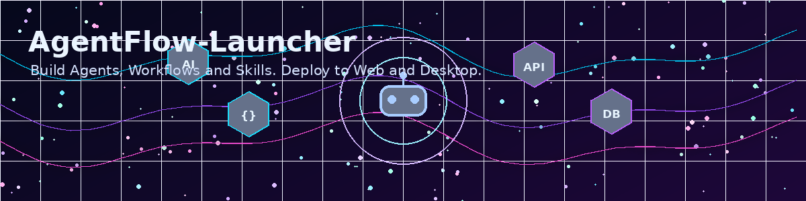
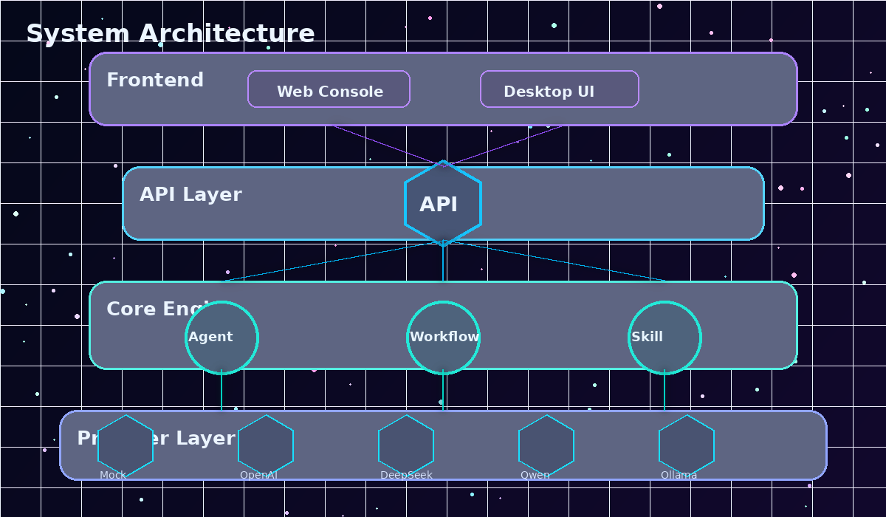
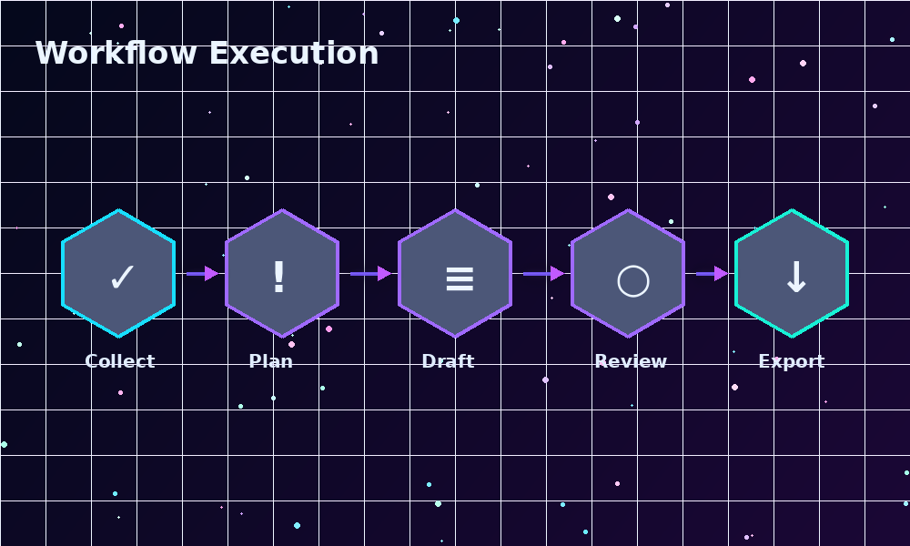
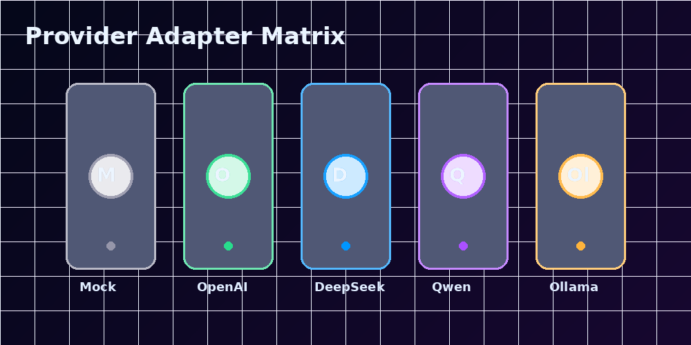
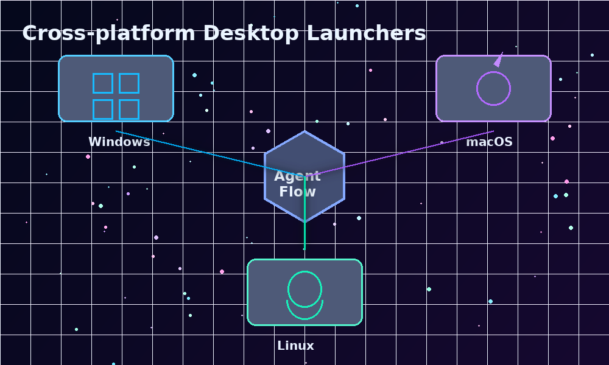
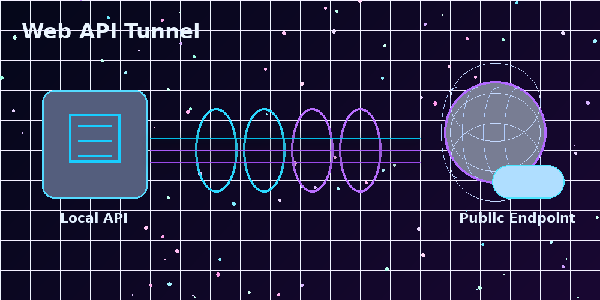
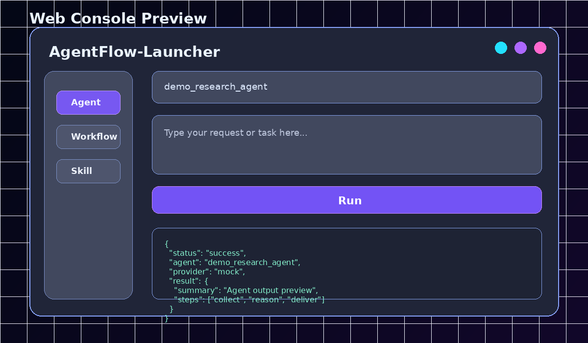

<p align="center">
  
</p>

<h1 align="center">🚀 AgentFlow-Launcher</h1>

<p align="center">
  <strong>Build &amp; Deploy LLM Agents, Workflows, and Skills — from Config to Cloud in Minutes</strong>
</p>

<p align="center">
  YAML-driven Agent, Workflow &amp; Skill builder with multi-provider LLM support<br>
  FastAPI REST API • Web Console • Desktop Launcher • One-click Deploy
</p>

<p align="center">
  
  
  
  
  
</p>

---

## 📖 目录

- [核心亮点](#-核心亮点)
- [架构概览](#-架构概览)
- [快速开始](#-快速开始)
- [使用示例](#-使用示例)
- [配置大模型](#-配置大模型)
- [桌面端部署](#-桌面端部署)
- [网页端与公网接口](#-网页端与公网接口)
- [项目结构](#-项目结构)
- [API 文档](#-api-文档)
- [测试](#-测试)
- [Roadmap](#-roadmap)
- [License](#-license)

---

## ✨ 核心亮点

<table>
<tr>
  <td width="50%">

### 🤖 Agent / Workflow / Skill 三合一
- **Agent**: 定义角色、工具、记忆、输入输出 Schema
- **Workflow**: 多步骤编排，步骤间传递上下文
- **Skill**: 可复用的 Prompt 模板模块
- 全部通过 **YAML 配置文件** 定义

  </td>
  <td width="50%">

### 🔌 多模型 Provider 适配
- OpenAI / DeepSeek / Qwen / Ollama
- 统一接口，切换 Provider 只需修改一行配置
- **Mock Provider 可离线运行**，无需任何 API Key
- 自动降级：API 不可用时回退到 Mock 模式

  </td>
</tr>
<tr>
  <td width="50%">

### 🌐 Web API + Swagger 文档
- FastAPI 高性能 REST API
- 自动生成的 Swagger UI 文档 (`/docs`)
- Pydantic 请求/响应验证
- CORS 支持，可被任何前端调用

  </td>
  <td width="50%">

### 🖥️ 跨平台桌面启动
- **Windows**: `.bat` 启动脚本 + `.ps1` 桌面快捷方式
- **macOS**: `.command` 脚本 + Dock 集成
- **Linux**: `.sh` 脚本 + `.desktop` 应用菜单
- 一键启动服务并自动打开浏览器

  </td>
</tr>
</table>

| | |
|---|---|
| 🎨 **Web 控制台** | 深色科技风 UI，蓝紫渐变，卡片式布局，适合截图展示 |
| 🌍 **公网域名暴露** | 支持 Cloudflare Tunnel / Ngrok / LocalTunnel 三种方案 |
| 📦 **一键打包发布** | `package_release.py` 自动排除敏感文件和构建产物 |
| ✅ **无 Key 也能跑** | Mock Provider 完全离线，无需任何 API 费用 |

---

## 🏗 架构概览

<p align="center">
  
</p>

```
用户输入 → Web Console / curl / 桌面快捷方式
                ↓
        FastAPI REST API (:8000)
                ↓
    ┌───────────────────────────┐
    │  Agent  │ Workflow │ Skill │  ← YAML 驱动
    └───────────────────────────┘
                ↓
    ┌───────────────────────────┐
    │ OpenAI │ DeepSeek │ Qwen  │  ← Provider 适配层
    │ Ollama │ Mock (离线)       │
    └───────────────────────────┘
```

### Workflow 执行流程

<p align="center">
  
</p>

每个 Workflow Step 的输出自动注入后续 Step 的上下文，实现多步骤编排。

---

## 🚀 快速开始

### 前提条件
- Python 3.10+
- Git

### 1. 克隆项目

```bash
git clone https://github.com/Laityperfect7/AgentFlow-Launcher.git
# Gitee 镜像: https://gitee.com/GM0531/agent-flow-launcher.git
cd AgentFlow-Launcher
```

### 2. 一键安装

**Windows (PowerShell):**
```powershell
powershell -ExecutionPolicy Bypass -File scripts/setup_windows.ps1
```

**macOS / Linux:**
```bash
bash scripts/setup_unix.sh
```

### 3. 配置环境（可选）

```bash
# 已自动从 .env.example 复制，如需修改：
# 编辑 .env，填入 API Key（Mock 模式无需配置）
```

### 4. 运行 Demo

```bash
python scripts/run_demo.py
```

输出示例：
```
============================================================
  AgentFlow-Launcher — Demo Runner
  Mode: MOCK (offline)
============================================================

[1/3] Running Agent: demo_research_agent
  ✓ Success (type=agent, name=demo_research_agent)

[2/3] Running Workflow: content_pipeline
  ✓ Success (type=workflow, name=content_pipeline)

[3/3] Running Skill: text_summarizer
  ✓ Success (type=skill, name=text_summarizer)

Demo Complete: 3/3 successful
```

### 5. 启动 Web 服务

```bash
python scripts/run_server.py
```

访问：
- 🖥️ **Web 控制台**: http://127.0.0.1:8000/console
- 📖 **API 文档**: http://127.0.0.1:8000/docs
- 🔍 **健康检查**: http://127.0.0.1:8000/health

---

## 📝 使用示例

### 定义 Agent

创建 `agents/my_agent.yaml`:

```yaml
name: my_agent
description: 我的自定义 Agent
model_provider: mock          # 或 openai / deepseek / qwen / ollama
model_name: mock-model
system_prompt: >
  你是一个专业的助手。请用中文回答，并提供结构化输出。

temperature: 0.7
max_tokens: 2048

tools:
  - name: search
    description: 搜索互联网信息

memory:
  type: buffer
  max_tokens: 4096
```

### 运行 Agent (curl)

```bash
curl -X POST http://127.0.0.1:8000/api/agents/demo_research_agent/run \
  -H "Content-Type: application/json" \
  -d '{"input": "AI 大模型应用开发趋势"}'
```

响应:
```json
{
  "success": true,
  "type": "agent",
  "name": "demo_research_agent",
  "input": "AI 大模型应用开发趋势",
  "output": {
    "background": "## Background\n\n...",
    "key_points": [...],
    "action_steps": [...],
    "risks": [...],
    "next_steps": [...]
  },
  "metadata": {
    "model_provider": "mock",
    "model_name": "mock-model"
  },
  "error": null
}
```

### 运行 Workflow

```bash
curl -X POST http://127.0.0.1:8000/api/workflows/content_pipeline/run \
  -H "Content-Type: application/json" \
  -d '{"input": "AI 编程助手开发指南"}'
```

### 运行 Skill

```bash
curl -X POST http://127.0.0.1:8000/api/skills/text_summarizer/run \
  -H "Content-Type: application/json" \
  -d '{"input": "需要被总结的长文本内容..."}'
```

---

## ⚙️ 配置大模型

### 支持的大模型 Provider

| Provider | 模型示例 | API Key 环境变量 | 获取地址 |
|----------|---------|-----------------|---------|
| **Mock** | mock-model | 无需 | 离线可用 |
| **OpenAI** | gpt-4o, gpt-4o-mini | `OPENAI_API_KEY` | [platform.openai.com](https://platform.openai.com/api-keys) |
| **DeepSeek** | deepseek-chat | `DEEPSEEK_API_KEY` | [platform.deepseek.com](https://platform.deepseek.com/api_keys) |
| **Qwen** | qwen-plus, qwen-max | `QWEN_API_KEY` | [dashscope.console.aliyun.com](https://dashscope.console.aliyun.com/apiKey) |
| **Ollama** | llama3, qwen2.5, ... | 无需 | [ollama.com](https://ollama.com) (本地) |

<p align="center">
  
</p>

### 切换 Provider

只需在 YAML 配置文件中修改一行：

```yaml
# 使用 Mock（离线调试）
model_provider: mock

# 使用 OpenAI
model_provider: openai
model_name: gpt-4o-mini

# 使用 DeepSeek
model_provider: deepseek
model_name: deepseek-chat

# 使用通义千问
model_provider: qwen
model_name: qwen-plus

# 使用本地 Ollama
model_provider: ollama
model_name: llama3
```

然后在 `.env` 中填入对应的 API Key 即可。

---

## 🖥️ 桌面端部署

<p align="center">
  
</p>

### Windows

| 操作 | 命令 |
|------|------|
| 一键启动 | 双击 `desktop/windows/start_agentflow.bat` |
| 创建快捷方式 | `powershell -File desktop/windows/create_shortcut.ps1` |

### macOS

| 操作 | 命令 |
|------|------|
| 赋予权限 | `chmod +x desktop/macos/start_agentflow.command` |
| 一键启动 | 双击 `start_agentflow.command` |
| 放入 Dock | 拖入 Dock 右侧 |

### Linux

| 操作 | 命令 |
|------|------|
| 赋予权限 | `chmod +x desktop/linux/start_agentflow.sh` |
| 一键启动 | `bash desktop/linux/start_agentflow.sh` |
| 应用菜单 | 复制 `.desktop` 到 `~/.local/share/applications/` |

---

## 🌍 网页端与公网接口

<p align="center">
  
</p>

### Web 控制台

<p align="center">
  
</p>

启动服务后访问: **http://127.0.0.1:8000/console**

功能：
- 选择运行类型（Agent / Workflow / Skill）
- 下拉选择具体模块
- 输入用户内容
- 点击 Run 查看 JSON 输出

### 临时公网暴露

| 方案 | 工具 | 安装 | 命令 |
|------|------|------|------|
| **A** | Cloudflare Tunnel | `winget install cloudflared` | `cloudflared tunnel --url http://127.0.0.1:8000` |
| **B** | Ngrok | `winget install ngrok` | `ngrok http 8000` |
| **C** | LocalTunnel | `npm i -g localtunnel` | `lt --port 8000` |

启动隧道后会获得类似以下的公网地址（**每次启动不同，此为示例**）：
- `https://xxxx.trycloudflare.com`
- `https://xxxx.ngrok-free.app`
- `https://xxxx.loca.lt`

📖 详细文档：[Cloudflare Tunnel](deploy/tunnel/cloudflare_tunnel.md) | [Ngrok](deploy/tunnel/ngrok.md) | [LocalTunnel](deploy/tunnel/localtunnel.md)

---

## 📁 项目结构

```
AgentFlow-Launcher/
├── README.md                           # 项目文档（你正在看）
├── LICENSE                             # MIT License
├── requirements.txt                    # Python 依赖
├── pyproject.toml                      # 项目元数据
├── .gitignore                          # Git 忽略规则
├── .env.example                        # 环境变量模板
│
├── agentflow/                          # 核心 Python 包
│   ├── core/
│   │   ├── agent.py                    # Agent 执行引擎
│   │   ├── workflow.py                 # Workflow 编排引擎
│   │   ├── skill.py                    # Skill 执行引擎
│   │   ├── loader.py                   # YAML 配置加载器
│   │   └── schemas.py                  # Pydantic 数据模型
│   ├── providers/
│   │   ├── base.py                     # Provider 抽象基类
│   │   ├── mock_provider.py            # Mock 离线 Provider ★
│   │   ├── openai_provider.py          # OpenAI 适配器
│   │   ├── deepseek_provider.py        # DeepSeek 适配器
│   │   ├── qwen_provider.py            # Qwen 适配器
│   │   └── ollama_provider.py          # Ollama 适配器
│   └── utils/
│       ├── config.py                   # 环境变量读取
│       └── logging.py                  # 日志配置
│
├── agents/                             # Agent YAML 配置
│   └── demo_research_agent.yaml        # 演示研究助手 Agent
│
├── workflows/                          # Workflow YAML 配置
│   └── content_pipeline.yaml           # 5 步内容生成流水线
│
├── skills/                             # Skill YAML 配置
│   ├── text_summarizer.yaml            # 文本摘要
│   ├── code_explainer.yaml             # 代码解释
│   └── prompt_optimizer.yaml           # Prompt 优化
│
├── server/                             # FastAPI Web 服务
│   └── main.py                         # API 入口
│
├── web/                                # Web 控制台前端
│   ├── index.html                      # 主页面
│   ├── styles.css                      # 深色科技风样式
│   └── app.js                          # 交互逻辑
│
├── desktop/                            # 桌面部署脚本
│   ├── windows/                        # Windows .bat + .ps1
│   ├── macos/                          # macOS .command + 指南
│   └── linux/                          # Linux .sh + .desktop
│
├── deploy/                             # 部署文档
│   └── tunnel/                         # 隧道方案文档 + 示例脚本
│
├── docs/                               # 详细文档
│   ├── architecture.md                 # 架构文档
│   ├── provider_adapters.md            # Provider 适配指南
│   ├── desktop_deployment.md           # 桌面部署指南
│   ├── web_api_deployment.md           # Web API 部署指南
│   └── images/                         # 文档图片
│
├── scripts/                            # 工具脚本
│   ├── setup_windows.ps1               # Windows 一键安装
│   ├── setup_unix.sh                   # macOS/Linux 一键安装
│   ├── run_server.py                   # 启动 API 服务器
│   ├── run_demo.py                     # 运行完整 Demo
│   ├── validate_project.py             # 项目完整性验证
│   └── package_release.py              # 打包发布
│
├── tests/                              # 测试套件
│   ├── test_agent_loader.py
│   ├── test_workflow_runner.py
│   ├── test_skill_runner.py
│   └── test_api_health.py
│
└── outputs/                            # 运行时输出（gitignore）
    └── .gitkeep
```

---

## 📖 API 文档

启动服务器后访问自动生成的交互式文档：

- **Swagger UI**: http://127.0.0.1:8000/docs
- **ReDoc**: http://127.0.0.1:8000/redoc

### 完整 API 列表

| 方法 | 路径 | 说明 |
|------|------|------|
| `GET` | `/` | 项目信息与可用模块列表 |
| `GET` | `/health` | 健康检查 |
| `GET` | `/api/agents` | 获取所有可用 Agent |
| `POST` | `/api/agents/{name}/run` | 运行指定 Agent |
| `GET` | `/api/workflows` | 获取所有可用 Workflow |
| `POST` | `/api/workflows/{name}/run` | 运行指定 Workflow |
| `GET` | `/api/skills` | 获取所有可用 Skill |
| `POST` | `/api/skills/{name}/run` | 运行指定 Skill |

### 请求/响应格式

**请求:**
```json
{
  "input": "用户输入文本",
  "params": {}
}
```

**响应:**
```json
{
  "success": true,
  "type": "agent | workflow | skill",
  "name": "模块名称",
  "input": "用户原始输入",
  "output": "...",
  "metadata": {},
  "error": null
}
```

---

## 🧪 测试

```bash
# 运行所有测试
pytest

# 运行指定测试文件
pytest tests/test_agent_loader.py -v

# 验证项目结构完整性
python scripts/validate_project.py --verbose
```

### Mock 模式测试

所有测试均在 Mock 模式下运行，无需 API Key，完全离线。

---

## 🗺 Roadmap

| 阶段 | 功能 | 状态 |
|------|------|------|
| **v1.0** | Agent / Workflow / Skill 基础框架 | ✅ 已完成 |
| **v1.0** | 多 Provider 适配层 | ✅ 已完成 |
| **v1.0** | FastAPI Web API + Swagger | ✅ 已完成 |
| **v1.0** | Web 控制台 | ✅ 已完成 |
| **v1.0** | 跨平台桌面脚本 | ✅ 已完成 |
| **v1.1** | Docker 一键部署 | 🔲 计划中 |
| **v1.2** | Electron 桌面应用 | 🔲 计划中 |
| **v1.3** | LangChain / LangGraph Adapter | 🔲 计划中 |
| **v1.4** | AutoGen Adapter | 🔲 计划中 |
| **v1.5** | MCP Server 支持 | 🔲 计划中 |
| **v1.6** | 多 Agent 协作 (Multi-agent) | 🔲 计划中 |
| **v1.7** | 浏览器自动化 (Playwright) | 🔲 计划中 |
| **v2.0** | 一键云部署 (Vercel / Railway) | 🔲 计划中 |
| **v2.1** | 可视化 Workflow 编辑器 | 🔲 计划中 |
| **v2.2** | Agent 市场 / Skill 商店 | 🔲 计划中 |

---

## 🤝 贡献

欢迎提交 Issue 和 Pull Request！

1. Fork 本项目
2. 创建特性分支 (`git checkout -b feature/amazing-feature`)
3. 提交更改 (`git commit -m 'Add amazing feature'`)
4. 推送到分支 (`git push origin feature/amazing-feature`)
5. 创建 Pull Request

---

## 📄 License

本项目采用 [MIT License](LICENSE)。

---

## ⭐ Star History

如果这个项目对你有帮助，请给一个 Star ⭐

---

<p align="center">
  <sub>Built with ❤️ by AgentFlow Team | Powered by Python + FastAPI</sub>
</p>
